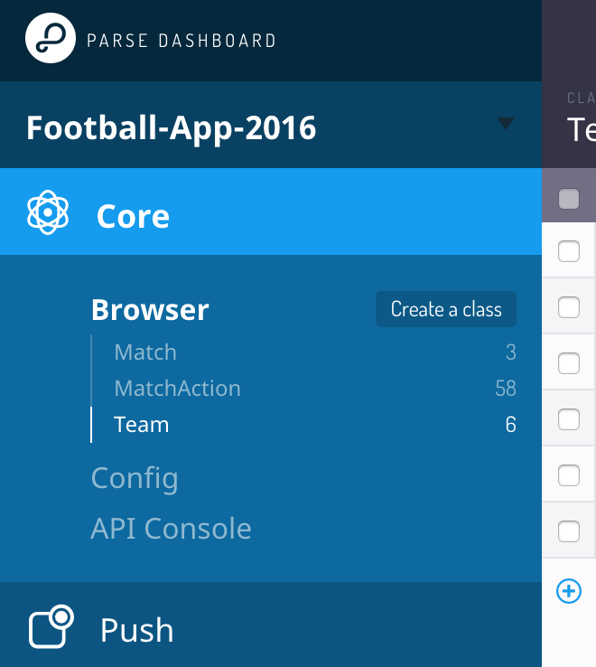

# Football App
Simple application for football fans.

## How We Build It

We used React Native, Redux, Relay, GraphQL, and more.

## Requirements

1. [React Native](http://facebook.github.io/react-native/docs/getting-started.html) (follow iOS and Android guides)
  - Xcode 7.3 +
2. [CocoaPods](http://cocoapods.org) (only for iOS)
  - Version 1.0+ recommended (`gem install cocoapods --pre`)
3. [MongoDB](https://www.mongodb.org/downloads) (needed to run Parse Server locally)

## Setup

1. **Clone the repo**

  ```
  $ git clone https://github.com/maryiv/football.git
  $ cd football
  ```


2. **Install dependencies** (npm v3+):

  ```
  $ npm install
  $ (cd ios; pod install)        # only for iOS version
  ```


3. **Make sure MongoDB is running:**

  If you prefer to use an external MongoDB server, set `DATABASE_URI`:

  ```
  $ export DATABASE_URI=mongodb://example-mongo-hosting.com:1337/my-awesome-database
  ```


4. **Create config file:**

  ```
  $ cd conf
  ```

  Copy the default file as `run.js`.


5. **Start Parse/GraphQL servers:**

  ```
  $ npm start
  ```


6. **Import sample data** (the local Parse Server should be running):

  ```
  $ npm run import-data
  ```

  Make sure everything works by visiting:

  Parse Dashboard: [http://localhost:8080/dashboard](http://localhost:8080/dashboard)
  
  
  
  You can check out their inquiries to:
  
  Graph*i*QL: [http://localhost:8080/graphql](http://localhost:8080/graphql)


7. **Running on Android**:

  ```
  $ react-native run-android
  ```


8. **Running on iOS:**

  ```
  $ react-native run-ios
  ```